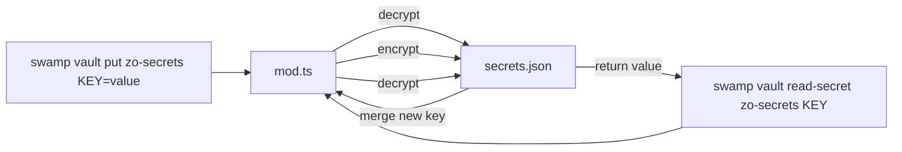
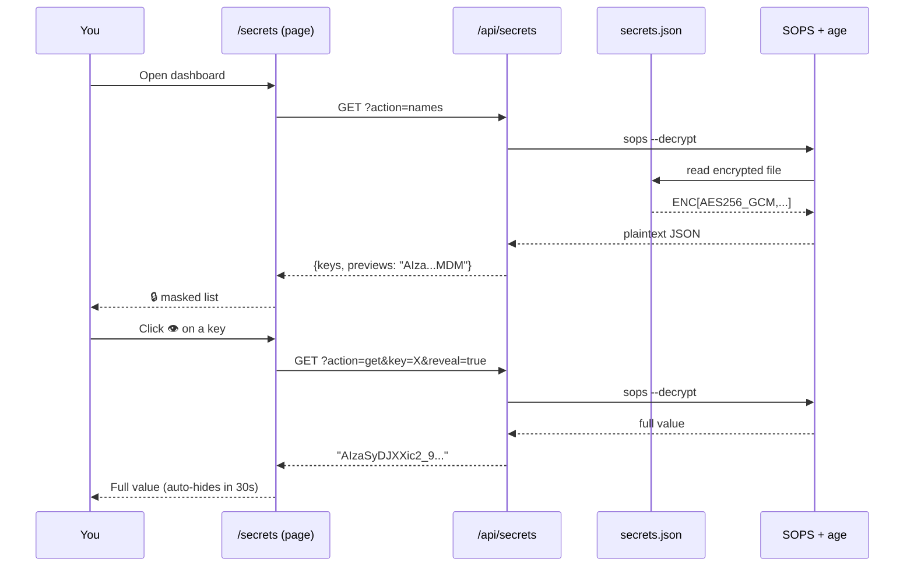

# HUMAN.md

> Zero-to-one guide for humans (not just devs).

## TL;DR

This is a **Swamp vault extension** that encrypts your secrets using [SOPS](https://github.com/mozilla/sops) + [age](https://github.com/FiloSottile/age). Secrets live as an encrypted JSON file on disk — no database, no server, no SaaS. You manage them through the `swamp vault` CLI or the Zo Space dashboard at `cashlessconsumer.zo.space/secrets`.

**Why?** Because `.env` files are plaintext, 1Password is SaaS, and HashiCorp Vault is overkill for a personal server. This gives you **AES-256-GCM encryption** with two open-source CLI tools and a single JSON file.

---

## The Problem

```
┌─────────────────────────────────────────────────────┐
│  How do people store secrets on personal servers?   │
├──────────────────────┬──────────────────────────────┤
│  .env files          │  ❌ Plaintext on disk        │
│  1Password / Bitwarden│  ❌ SaaS — your data,       │
│                      │     their server             │
│  HashiCorp Vault     │  ❌ Enterprise footprint      │
│  Docker secrets      │  ❌ Tied to container        │
│  CI/CD vaults        │  ❌ Not for personal use     │
└──────────────────────┴──────────────────────────────┘
```

## The Solution

```
┌──────────┐    encrypt     ┌──────────────────┐
│  plaintext│ ──SOPS+age──▶ │  secrets.json    │
│  secrets  │               │  (AES-256-GCM)   │
│  in RAM   │ ◀──SOPS+age── │  on disk         │
└──────────┘    decrypt     └──────────────────┘
      ▲                               │
      │                               │
   swamp CLI                    git-friendly
   Zo dashboard                 fully portable
```

Two tools, one file, zero network.

---

## How It Works — Step by Step

### 1. Age generates your encryption keypair

[age](https://github.com/FiloSottile/age) is a modern file encryption tool (Go, single binary, no config).

```bash
age-keygen -o age.key
# Public key:  age1x7qp5...   ← share this
# Private key: age.key        ← guard this with your life
```

Think of it as **SSH for files** — asymmetric encryption with dead-simple key management.

### 2. SOPS encrypts using that key

[SOPS](https://github.com/mozilla/sops) (Secrets OPerationS) by Mozilla is an encrypted file editor. It:

1. Takes a JSON/YAML file
2. Encrypts each value with AES-256-GCM
3. Wraps the data key with age
4. Writes the result back

```bash
# Before (what you see editing)
{ "GEMINI_API_KEY": "AIzaSyD..." }

# After (what's on disk)
{
  "GEMINI_API_KEY": "ENC[AES256_GCM,data:8fKj...,iv:abc...,tag:def...,type:str]",
  "sops": { "age": ["age1x7qp5..."] }
}
```

### 3. Swamp makes it a vault

[Swamp](https://swamp.systeminit.com) is a workflow engine. This extension plugs SOPS+age into Swamp's vault system:



### 4. Zo Space gives you a web dashboard

A private page at `cashlessconsumer.zo.space/secrets` with a backing API:



---

## The Encryption Chain

```
Your secret value
        │
        ▼
  ┌─────────────┐
  │ AES-256-GCM │  ← each value encrypted individually
  │  (data key) │
  └──────┬──────┘
         │
         ▼
  ┌─────────────┐
  │ age (X25519)│  ← data key encrypted with your public key
  │  (key wrap) │
  └──────┬──────┘
         │
         ▼
  secrets.json     ← everything in one file, git-friendly
```

- **AES-256-GCM** — symmetric encryption for each value (fast, authenticated)
- **age (X25519)** — asymmetric key wrap for the data key (your public key)
- **Result** — only someone with `age.key` can decrypt. One file, fully portable.

---

## What's in This Repo

```
swamp-sops-age/
├── HUMAN.md              ← you are here
├── LICENSE.txt            ← Apache-2.0
├── README.md              ← developer reference
├── manifest.yaml          ← swamp extension manifest
└── vaults/sops-age/
    ├── mod.ts             ← vault provider (get/put/list)
    └── vault_test.ts      ← conformance tests (10 tests)
```

---

## Quick Start (5 minutes)

### Prerequisites

```bash
# Install SOPS
curl -fsSL https://github.com/mozilla/sops/releases/latest/download/sops-vX.XX.X.linux.amd64 \
  -o /usr/local/bin/sops && chmod +x /usr/local/bin/sops

# Install age (Debian/Ubuntu)
apt install age

# Install swamp
# See https://swamp.systeminit.com
```

### Install & Create Vault

```bash
# Pull the extension
swamp extension pull @cashlessconsumer/sops-age

# Generate a keypair (once)
age-keygen -o ~/.secrets/age.key

# Create the vault instance
swamp vault create @cashlessconsumer/sops-age my-secrets \
  --config '{
    "secretsFile": "/home/user/.secrets/secrets.json",
    "agePublicKey": "age1x7qp5...",
    "ageKeyFile": "/home/user/.secrets/age.key"
  }'
```

### Use It

```bash
# Store a secret
swamp vault put my-secrets GEMINI_API_KEY=AIzaSyDJXX...

# Read it back
swamp vault read-secret my-secrets GEMINI_API_KEY --force

# List all keys
swamp vault list-keys my-secrets --json

# Use in swamp workflows via CEL
${{ vault.get(my-secrets, GEMINI_API_KEY) }}
```

---

## Key Decisions & Tradeoffs

| Decision | Why |
|---|---|
| **age over GPG** | age is simpler, faster, no web-of-trust complexity |
| **SOPS over raw age** | SOPS preserves JSON structure, encrypts values only (keys stay searchable) |
| **JSON over YAML** | Universal compatibility, no indentation fragility |
| **Single file over directory** | Easy to git-track, backup, sync across machines |
| **CLI wrappers over Go SDK** | No build step, works with any SOPS/age version |
| **No server** | Reduces attack surface — no daemon, no port, no network |

---

## Security Notes

- `age.key` is the **only** secret you must protect. Lose it → lose all secrets.
- `secrets.json` is safe to commit (everything is `ENC[...]`), but `.gitignore` is included anyway.
- The public key (`age.pub`) is safe to share — it's used for encryption, not decryption.
- The Zo dashboard shows `first4••••last4` by default. Full values require explicit reveal and auto-hide after 30s.

---

## Links

- **SOPS** — https://github.com/mozilla/sops
- **age** — https://github.com/FiloSottile/age
- **Swamp** — https://swamp.systeminit.com
- **Zo Computer** — https://zocomputer.com
- **Extension repo** — https://github.com/CCAgentOrg/swamp-sops-age

---

## License

Apache-2.0
